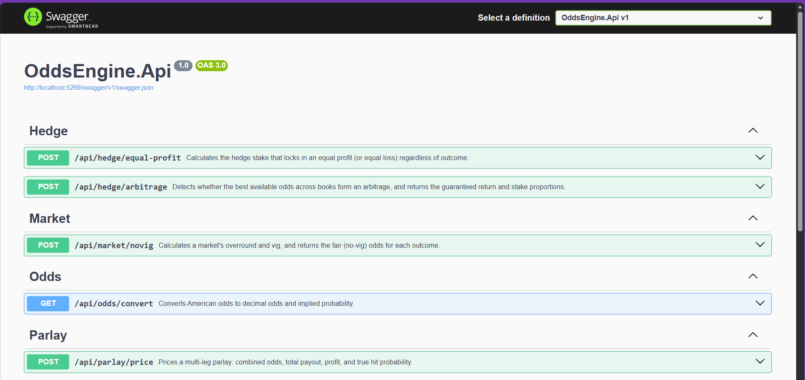
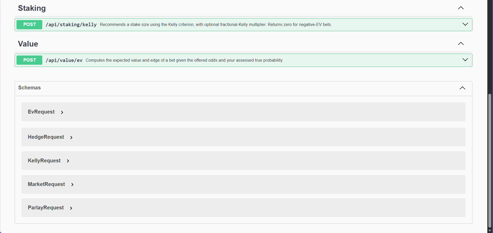

# OddsEngine

A sports betting mathematics API built with C# and ASP.NET Core. Goes beyond
basic odds converters: no-vig fair pricing, expected value, Kelly criterion
staking, hedge lock-in, and cross-book arbitrage detection — fully
unit-tested with xUnit.

## Why these calculations

Most free betting calculators convert odds or price a parlay. The math that
actually matters to a serious bettor is harder to find in one place:

- **No-vig fair odds** — a sportsbook's listed odds imply probabilities
  summing past 100%; the excess is the book's margin (the "vig"). Removing
  it reveals the market's true probability estimate — the baseline every
  other judgment depends on.
- **Expected value & edge** — whether a bet is profitable at your assessed
  probability, and by how much.
- **Kelly criterion staking** — the bankroll fraction that maximizes
  long-run growth, with fractional-Kelly support. Returns zero for
  negative-EV bets by construction.
- **Hedge lock-in** — the exact opposing stake that guarantees equal
  profit regardless of outcome.
- **Arbitrage detection** — flags when best-available odds across books
  imply probabilities summing under 100%, with per-outcome stake
  proportions.

## Stack

C# / .NET 8 · ASP.NET Core Web API · xUnit · Swagger/OpenAPI

## Endpoints

| Method | Route | Description |
|---|---|---|
| GET | /api/odds/convert | American ⇄ decimal ⇄ implied probability |
| POST | /api/market/novig | Overround, vig, and fair odds per outcome |
| POST | /api/parlay/price | Combined odds, payout, profit, hit probability |
| POST | /api/value/ev | Expected value and edge |
| POST | /api/staking/kelly | Kelly fraction and recommended stake |
| POST | /api/hedge/equal-profit | Hedge stake and locked profit |
| POST | /api/hedge/arbitrage | Arb detection, return %, stake proportions |

## Running it

    dotnet run --project OddsEngine.Api

Interactive docs at `/swagger`.

## Tests

    dotnet test

Unit tests cover odds conversions, vig removal, parlay math, EV, Kelly
staking, and hedge/arbitrage logic — including edge cases like negative-EV
Kelly (bet zero) and equal-loss hedges.

## Example

**POST /api/market/novig** with `{ "americanOdds": [-110, -110] }`:

    {
      "overround": 1.0476,
      "vigPercent": 4.76,
      "outcomes": [
        {
          "listedAmerican": -110,
          "listedImpliedProbability": 0.5238,
          "fairAmerican": 100,
          "fairProbability": 0.5
        },
        {
          "listedAmerican": -110,
          "listedImpliedProbability": 0.5238,
          "fairAmerican": 100,
          "fairProbability": 0.5
        }
      ]
    }

The standard -110/-110 market: each side priced at an implied 52.38%, summing to 104.76%. Remove the 4.76% vig and it's a true 50/50.