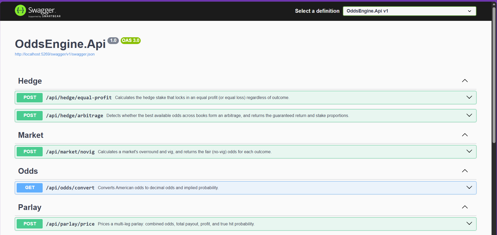
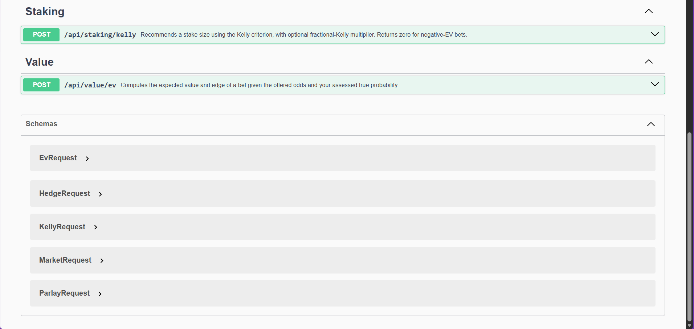

# OddsEngine

A sports betting mathematics API built with C# and ASP.NET Core. Goes beyond
basic odds converters: no-vig fair pricing, expected value, Kelly criterion
staking, hedge lock-in, and cross-book arbitrage detection, fully unit-tested
with xUnit.

**Live demo: https://oddsengine-ui.vercel.app**

**API docs: https://oddsengine-production.up.railway.app/swagger**

Frontend source: https://github.com/Lunaris47/oddsengine-ui

Note: the API sleeps when idle, so the first request after a quiet period can
take 20 to 30 seconds to wake up.

## Why these calculations

Most free betting calculators convert odds or price a parlay. The math that
actually matters to a serious bettor is harder to find in one place:

- **No-vig fair odds**: a sportsbook's listed odds imply probabilities summing
  past 100%, and the excess is the book's margin (the "vig"). Removing it
  reveals the market's true probability estimate, which is the baseline every
  other judgment depends on.
- **Expected value and edge**: whether a bet is profitable at your assessed
  probability, and by how much.
- **Kelly criterion staking**: the bankroll fraction that maximizes long-run
  growth, with fractional Kelly support. Returns zero for negative-EV bets by
  construction.
- **Hedge lock-in**: the exact opposing stake that guarantees an equal result
  regardless of outcome, including the equal-loss case when the line has moved
  against you.
- **Arbitrage detection**: flags when best-available odds across books imply
  probabilities summing under 100%, with per-outcome stake proportions.

## Stack

C# / .NET 8, ASP.NET Core Web API, xUnit, Swagger/OpenAPI, Docker

## Endpoints

| Method | Route | Description |
|---|---|---|
| GET | /api/odds/convert | American, decimal, and implied probability |
| POST | /api/market/novig | Overround, vig, and fair odds per outcome |
| POST | /api/parlay/price | Combined odds, payout, profit, hit probability |
| POST | /api/value/ev | Expected value and edge |
| POST | /api/staking/kelly | Kelly fraction and recommended stake |
| POST | /api/hedge/equal-profit | Hedge stake and locked profit |
| POST | /api/hedge/arbitrage | Arb detection, return percentage, stake proportions |

## Running it locally

    dotnet run --project OddsEngine.Api

Interactive docs at `/swagger`.

## Tests

    dotnet test

Unit tests cover odds conversions, vig removal, parlay math, EV, Kelly staking,
and hedge/arbitrage logic, including edge cases like negative-EV Kelly (bet
zero) and equal-loss hedges.

## Deployment

Containerized with a multi-stage Dockerfile: the .NET SDK image compiles and
publishes the API, then only the build output is copied into a smaller ASP.NET
runtime image. The container runs on Railway.

The React frontend is deployed separately on Vercel and calls this API over
HTTPS, with a CORS policy allowing the production frontend origin alongside
localhost for development.

## Example

**POST /api/market/novig** with `{ "americanOdds": [-110, -110] }`:

    {
      "overround": 1.0476,
      "vigPercent": 4.76,
      "outcomes": [
        {
          "listedAmerican": -110,
          "listedImpliedProbability": 0.5238,
          "fairAmerican": 100,
          "fairProbability": 0.5
        },
        {
          "listedAmerican": -110,
          "listedImpliedProbability": 0.5238,
          "fairAmerican": 100,
          "fairProbability": 0.5
        }
      ]
    }

The standard -110/-110 market: each side priced at an implied 52.38%, summing
to 104.76%. Remove the 4.76% vig and it is a true 50/50.
